# Production Architecture — Secure Multi‑Tenant Payroll Platform

```mermaid
flowchart LR
  %% Actors
  User[User / Client]

  %% IAM & Security (logical grouping)
  subgraph IAM["IAM & Security"]
    direction TB
    TenantRoles["Tenant IAM Roles\n(company / bureau / employee)"]
    SGs["Security Groups\n(tenant-SG, db-SG)"]
    Secrets["Secrets Manager\n(DB credentials)"]
  end

  %% Storage grouping (outside VPC logically)
  subgraph Storage["Storage (Global)"]
    direction TB
    S3["S3 Bucket\n(prefix-based tenant isolation, SSE-KMS)"]
  end

  %% VPC and subnets
  subgraph VPC["VPC — prod-vpc"]
    direction TB
    IGW["Internet Gateway"]
    NAT["NAT Gateway (Public)"]

    subgraph Public["Public Subnets"]
      direction TB
      Bastion["Bastion / ALB (optional)"]
    end

    subgraph Private["Private Subnets"]
      direction TB
      S3VPCE["S3 Gateway Endpoint"]

      subgraph Tenants["Tenant Compute (private subnets)"]
        direction TB
        EC2_companies["EC2 - companies (tenant group)"]
        EC2_bureaus["EC2 - bureaus (tenant group)"]
        EC2_employees["EC2 - employees (tenant group)"]
      end

      RDS["RDS PostgreSQL\n(private subnet, encrypted)"]
    end
  end

  %% Logical connections / data flows
  User -->|HTTPS / App Requests| EC2_companies
  User -->|HTTPS / App Requests| EC2_bureaus
  User -->|HTTPS / App Requests| EC2_employees

  %% EC2 to DB, S3, Secrets
  EC2_companies -->|DB connection (private)| RDS
  EC2_bureaus -->|DB connection (private)| RDS
  EC2_employees -->|DB connection (private)| RDS

  EC2_companies -->|S3 API (Put/Get)| S3
  EC2_bureaus -->|S3 API (Put/Get)| S3
  EC2_employees -->|S3 API (Put/Get)| S3

  EC2_companies -->|SecretsManager:GetSecretValue| Secrets
  EC2_bureaus -->|SecretsManager:GetSecretValue| Secrets
  EC2_employees -->|SecretsManager:GetSecretValue| Secrets

  %% Network pathing and endpoints
  Bastion -->|SSM / Management| EC2_companies
  Bastion --> EC2_bureaus
  Bastion --> EC2_employees

  IGW --> Bastion
  NAT --> Private
  S3VPCE --> S3

  %% Security bindings
  TenantRoles -->|assume_role / short-term creds| EC2_companies
  TenantRoles --> EC2_bureaus
  TenantRoles --> EC2_employees

  SGs --> EC2_companies
  SGs --> EC2_bureaus
  SGs --> EC2_employees
  SGs --> RDS

  Secrets -->|credential store| RDS

  %% Visual grouping notes
  classDef groupFill fill:#f8f9fa,stroke:#cbd5e1;
  class VPC,Public,Private,Tenants,Storage,IAM groupFill;
```

## Architecture Overview

- A single AWS account hosts a production-grade VPC with public and private subnets across AZs. Public subnets contain management endpoints (bastion/ALB, NAT). Private subnets host tenant EC2 instances and the RDS PostgreSQL instance.
- Storage uses a single S3 bucket with SSE-KMS and a bucket policy enforcing prefix-based tenant isolation (each tenant writes under its own prefix).
- IAM provides per-tenant roles and instance profiles used by EC2 instances; tenant roles are granted least-privilege access to their S3 prefix and to read the specific Secrets Manager secret containing DB credentials.

## Data Flow

- User → EC2: Application requests arrive at tenant EC2 instances (via ALB or direct HTTPS endpoints) and are processed in private subnets.
- EC2 → RDS: EC2 instances connect to the RDS PostgreSQL instance over the private network; access is restricted by Security Group rules to tenant SGs and the DB SG.
- EC2 → S3: EC2 performs object operations against the single S3 bucket; bucket policy + IAM role scoping restrict access to the tenant prefix (e.g., `s3://bucket/<tenant>/*`). Traffic to S3 may transit the VPC S3 Gateway endpoint.
- EC2 → Secrets Manager: EC2 retrieves DB credentials via `secretsmanager:GetSecretValue` using its tenant IAM role; secrets are not written to Terraform outputs.

## Tenant Isolation Model

- Compute isolation: tenants run in logically separated EC2 instances and are associated with tenant-specific Security Groups and IAM roles.
- Storage isolation: a global S3 bucket with strict prefix-level policies ensures that each tenant's objects are accessible only by the tenant role and service principals explicitly listed in the policy.
- Data isolation: RDS is a single PostgreSQL instance in private subnets. Tenant access is controlled via application-level separation and IAM + SG controls; consider separate DB instances or schemas with row-level security for stronger isolation.

## Security Design

- Least-privilege IAM: tenant IAM roles grant only the precise S3 prefixes and the single Secrets Manager secret ARN required for DB credentials.
- Secrets handling: DB credentials are stored in AWS Secrets Manager; applications retrieve credentials at runtime. Terraform does not emit secret values as outputs.
- Network controls: no public IPs on tenant EC2 instances, private RDS, and S3 Gateway endpoint to keep storage traffic on the AWS network. NAT and IGW provide controlled egress for private subnets and public management endpoints respectively.
- Encryption: S3 uses SSE-KMS; RDS storage is encrypted. KMS policies and grants should be restricted to the required principals.

---

If you'd like, I can now run a quick pass to validate that the diagram labels exactly match resource names in your Terraform code (e.g., `module.vpc`, `module.storage`, `module.iam`, `module.database`) and adjust any naming mismatches.
# Payroll Infrastructure Architecture

This Terraform project creates the following AWS resources for the payroll platform:

- VPC with public and private subnets across at least two availability zones
- NAT Gateway for outbound access from private subnets
- Three isolated EC2 instances, one per tenant type: Companies, Bureaus, Employees
- RDS PostgreSQL database in a private subnet
- Versioned S3 bucket for payroll documents and reports
- IAM roles scoped per tenant for tenant-specific resource access
- Security Groups and NACLs to isolate traffic between tenant environments

## Architecture Diagram

```mermaid
flowchart LR
  A[VPC] --> B[Public Subnets]
  A --> C[Private Subnets]
  B --> IGW[Internet Gateway]
  B --> NAT[NAT Gateway]
  C --> EC2C[Companies Backend EC2]
  C --> EC2B[Bureaus Backend EC2]
  C --> EC2E[Employees Backend EC2]
  C --> RDS[RDS PostgreSQL]
  A --> S3[Payroll Documents S3 Bucket]
  EC2C -->|S3 access| S3
  EC2B -->|S3 access| S3
  EC2E -->|S3 access| S3
  EC2C -->|DB access| RDS
  EC2B -->|DB access| RDS
  EC2E -->|DB access| RDS
  subgraph IAM
    IR[Companies IAM Role]
    IB[Bureaus IAM Role]
    IE[Employees IAM Role]
  end
  IR --> EC2C
  IB --> EC2B
  IE --> EC2E
```


