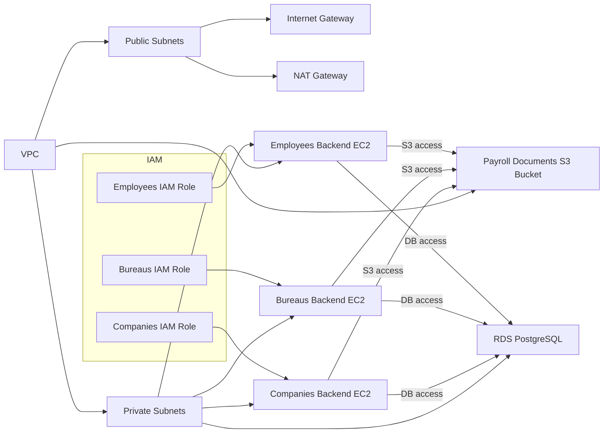

# Payroll Infrastructure Architecture

This Terraform project creates the following AWS resources for the payroll platform:

- VPC with public and private subnets across at least two availability zones
- NAT Gateway for outbound access from private subnets
- Three isolated EC2 instances, one per tenant type: Companies, Bureaus, Employees
- RDS PostgreSQL database in a private subnet
- Versioned S3 bucket for payroll documents and reports
- IAM roles scoped per tenant for tenant-specific resource access
- Security Groups and NACLs to isolate traffic between tenant environments

## Architecture Diagram

